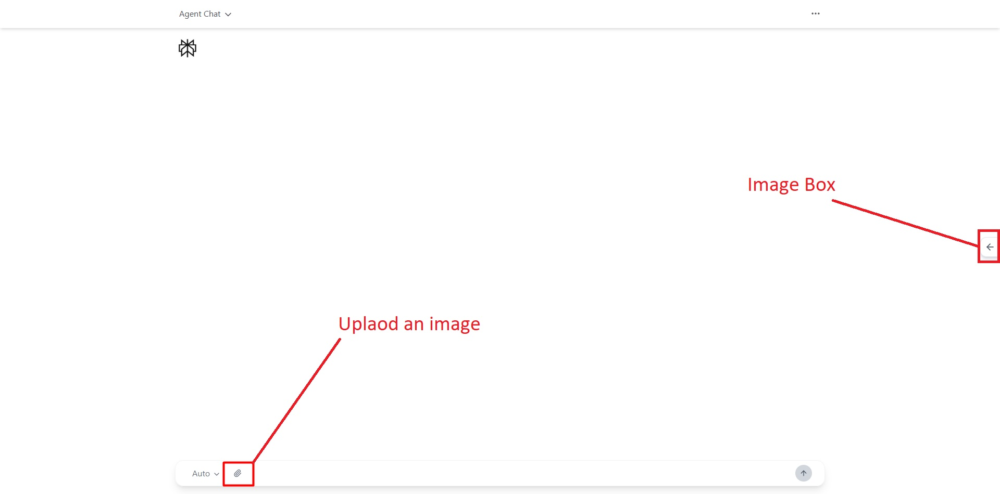
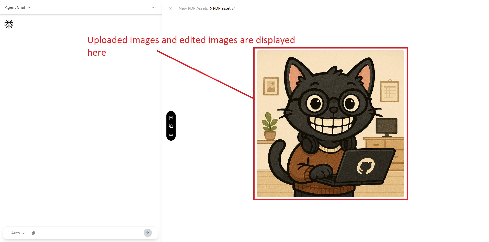
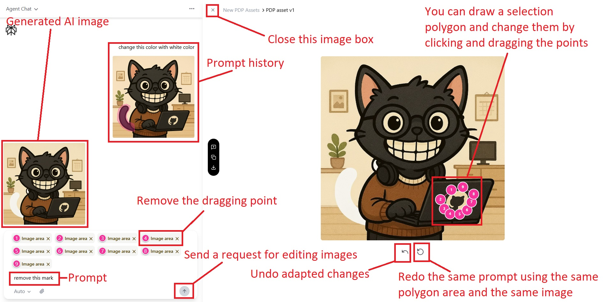
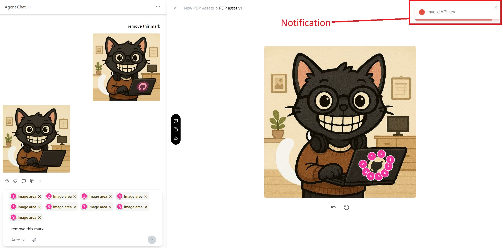

# Image Annotation for AI Edits

A lightweight web app that lets users upload an image, draw a freeform selection over a region they want edited, describe the desired change, and receive an AI-generated result for just that selected area.

This project was built as a focused UX + interaction exercise to demonstrate state handling, drawing interactions, and AI-assisted image editing flows.

---

## ✨ Features

- Upload an image
- Draw a freeform selection directly on the image
- Enter a natural-language prompt for the selected region
- Submit the selection + prompt to an AI image editing model
- Display a loading state while generating
- Render the edited image result
- Undo / redo selection edits
- Iteratively re-edit the generated image with new selections and prompts

---

## 🛠️ Tech Stack

**Frontend**

- React
- TypeScript
- Vite
- Tailwind CSS

**Backend / AI**

- Replicate API
- Nano-Banana model

---

## 📸 Screenshots

You can refer to the screenshots below to understand how the app works and how the interaction flow behaves end-to-end.






---

## 🧭 How to Use

Follow these steps to edit a specific region of an image using AI:

### 1. Upload an Image

Upload an image file using the input field. The selected image will appear in the preview area.

### 2. Draw a Selection

Create a polygon around the region you want to edit. You can adjust the shape by dragging any of the control points. To remove control points, use the “Remove” buttons in the input panel.

### 3. Enter a Prompt & Submit

Describe the edit you want applied to the selected region, then submit your prompt.

### 4. View Results & History

Your prompt history and all generated images are displayed in the history panel.

### 5. Undo / Redo

Use the provided controls to undo or redo changes made to your selection.

### 6. Iterate on Results

Continue refining the image by repeating the selection and prompt steps on each newly generated output.

### 7. Notifications

Notifications appear when an error occurs or when an AI‑generated image is ready.

### 8. Disabled Actions

During Processing While an image is loading or being generated, the following actions are temporarily disabled:

- Modifying the selection
- Entering a prompt
- Uploading a new image
- Undo and redo operations

---

## 🚀 Getting Started

### Prerequisites

- Node.js (v18+ recommended)
- npm
- A Replicate API token for Nano Banana AI API

### Setup Environment Variables

Before running the app, create a `.env` file in the project root and add your Replicate API token:

```
REPLICATE_API_TOKEN=[YOUR_API_TOKEN_HERE]
```

### Install Dependencies

```
npm install --save-dev concurrently
npm install:all
```

### Run the App

```
npm start
```

This will start both the frontend and backend services concurrently.

---

## 🧠 Process

**Tools Used**

- React + TypeScript for type safety and maintainability
- Vite for fast local development
- Tailwind CSS for rapid UI iteration
- Replicate API for AI-powered image editing

**Key Decisions**

- Implemented freeform drawing with a canvas overlay for responsive, natural-feeling interactions
- Modeled the UX as a clear linear flow: `Upload` → `Draw` → `Prompt` → `Loading` → `Result`
- Kept the UI minimal to emphasize interaction quality and clarity of state transitions
- Prioritized usability over pixel-perfect fidelity where the design reference was ambiguous
- Added undo/redo functionality to support quick iteration and refinement during the selection process
- Designed the flow to support iterative edits on generated images over multiple passes

**What I’d Do With More Time**

- Support multiple annotations and editing multiple images
